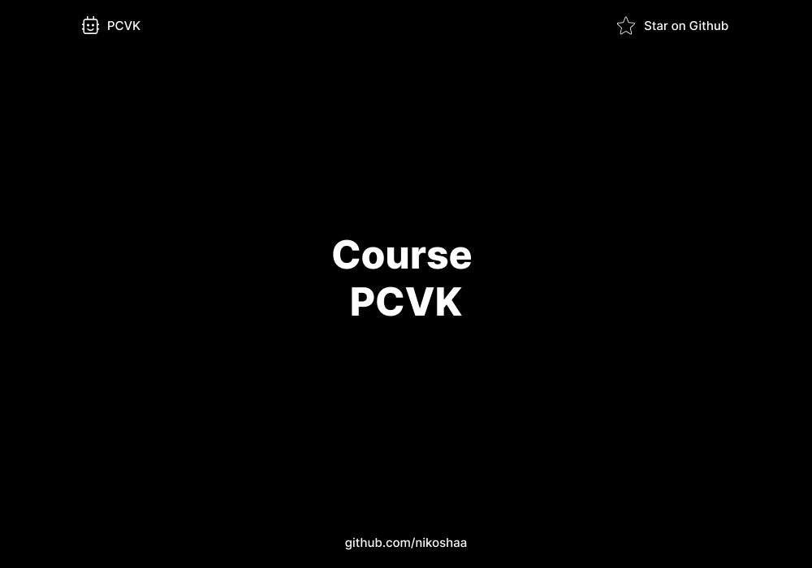

# Computer Vision and Image Processing Course

## Overview

Computer Vision and Image Processing are interdisciplinary fields in computer science and engineering that focus on the understanding, analysis, and manipulation of visual data, such as images and videos, using computational techniques.

## Contributors

[Wildan Hafidz Mauludin](https://github.com/nikoshaa)
[Bima Bayu Saputra](https://github.com/BimaBayuUWUUU)
[Sely Ruli Amanda](https://github.com/selyraa)

## License

MIT License